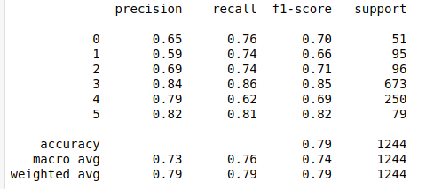

# URL Industry Classifier
A text classifier API that accepts url of a company and returns the industry the company belongs to.

## Demo
- The API is running at **http://databaaz.me:8080/classifier** (not running anymore)
- You can send a curl POST command to the above address along with JSON data carrying **url** field with URL of the business as its value.
- The response will be a JSON data having **status** field with value either *success* or *failure*.
- In case of a *failure*, the corresponding error message will be stored in JSON response under **error** field.
- In case of a *success*, the response will have **url** field, and **category** field whose value depicts one of the 6 categories that the business belongs to.
- Sample curl command:  
  `curl http://databaaz.me:8080/classifier  -X POST -H 'content-type: application/json' -d '{"url": "http://bigbazaar.com/"}'`  
- The above command will yield the following response:  
  **`{"category":"CPG","url":"http://bigbazaar.com/"}`**

## Setup  
You can run the Flask API server on your own machine and make requests to it:
1. Clone this repository
2. Create conda environment using `environment.yml` file in the repository:  
  `conda env create -f environment.yml`  
  This creates a conda environment from the given file with the enviroment name **url_mapper** and installs all the specified dependencies in it.
3. Activate the environment:  
  `conda activate url_mapper`
4. Enter the *classifier-api* directory and run the server:  
  `cd classifier-api`    
  `python app.py`  
5. This will start the Flask server on port 5000 of your localhost.
6. You can then make POST requests to your localhost using curl command mentioned above, replacing `databaaz.me:8080` with `localhost:5000`
  
  

## Project Summary
- The task is to build a mapper that accepts URL of a business and returns the industry of that business.
- The solution includes building a text classifier that accepts the content of the landing page of the business website and returns its category. The classifier is then deployed as a Flask API.   

#### Data
- The [dataset](https://d1p17r2m4rzlbo.cloudfront.net/wp-content/uploads/2016/03/Company-Categorization-DFE.csv) obtained from FigureEight had information about businesses including their names, URLs, categories etc.It has **7335 rows** and **32 columns**
- The dataset has 6 different kinds of business categories:
    1. Automotive
    2. Consumer Packaged Goods (CPG)
    3. Financial Services
    4. Retail
    5. Travel
    6. Other
  - The columns of our interest (for our NLP text classifier) are **google1_correct_website** and **business_category**
  
#### Solution
 1. The first step was to fetch the text content from the HTML document of the landing pages of the URLs.
 2. I used Python's `request` and `BeautifulSoup` modules to fetch the textual content of the website (without html tags, JS codes and other meta data) and stored them in a new column called **site-content**.
 3. In order to build a classifier, the textual content had to be converted into numeric features. I tried two approaches:  
    * **Bag of Words approach (Count Vectorization):** The documents are tokenized into words and their frequencies recorded. Words appearing across all documents are features. Each document is a sample and the occurence of words(1/0) in the document are values.This structured dataset can then be trained on any multi-class classifier algorithm.
        
    * **TF-IDF  Vectorization:** It stands for *Term Frequency and Inverse Document Frequency* and ranks the words not just based on their occurence in a document but also on their importance across all documents.  
          The tf-idf weight is composed of 2 terms - the first term computes the normalized frequency of the words(tokens) in the document (just like count vectorization), the second term (IDF) measures how frequently the word occurs across all documents. 
        
         If the word appears more frequently, it is a common word and has lesser significance and hence is given lower weight, whereas if the word is rare and is found only in a few documents then it has higher significance and is assigned higher weight. Product of the two terms is the tf-idf weight of the word and becomes the value of that feature in that dataset.
        
        tf(x) =  (Number of times term x appears in a document) / (Total number of terms in the document)  
        idf(x) = ln(Total number of documents / Number of documents with term t in it)  
        The value of a feature will be the product of above 2 quantities for that feature(word).  
        This structured dataset can then be used to build a classifier on top of it and make predictions.
    
    * In both the approaches, the most commonly occuring words or **stopwords** (is, the, or, in, etc.) had to be removed because they would then contribute negatively to the inference of the correct class.
    * Vectorization was performed using Python's `nltk` library.
    

4. The best model is deployed into productio as a Flask API, that accepts input URL in JSON format and returns the inferences in JSON format.
    

#### Inference:
1. The trained model and the tfidf vectorization estimators are stored on disk using `pickle`.
2. When the app starts these two files are loaded into variables.
3. When the API receives a request with a valid URL, we fetch the landing page content using the URL. The fetched content is then transformed into a TF-IDF vector using the estimator. 
4. The transformed vector is then given as an input to the model's `predict` function which returns the class with highest probability.
5. The corresponding class is returned as a response in JSON format.

#### Challenges:
1. Data of Multiple Languages
  - The number one challenge was existence of data from multiple languages. Though the majority of the URLs were of English websites, a significant number of websites had content of other languages like German, Spanish, French, etc.
  - Now finding numeric embeddings across data of all languages is a challenging task, because two words from different languages that represent the same entity would then be treated as distinct independent tokens.
  - Hence I built a text classifier only for English websites.
  - Language Indepencence in NLP is an active area of research and good solutions around that would be available soon.
  - The language of the fetched content was determined using Python's `langdetect` library.
  
2. NULL Data
  - Apart from some 32 rows with empty values for the target variable, there was another problem that reduced the dataset size considerably.
  - Many URL's could either be not reached or took to long to response and hence returned null values for *site-content*
  - All Null values were dropped, and a subset of English language websites were chosen for training the classifier.
  - The final dataset used for vectorization had 4144 documents.
  

#### Results:
1. The final dataset was trained on a number of classifiers including **Logistics Regression**, **Naive Bayes**, **Linear SVM**, and **Random Forest**.
2. These models were trained with default values and were not fine-tuned later. Each of them gave decent results (>75% accuracy)
3. I then created an ensemble of all the above models, using **hard voting** to aggregate their outputs.
4. The ensembled model resulted in **79% accuracy** on test data, and good precision-recall values:

